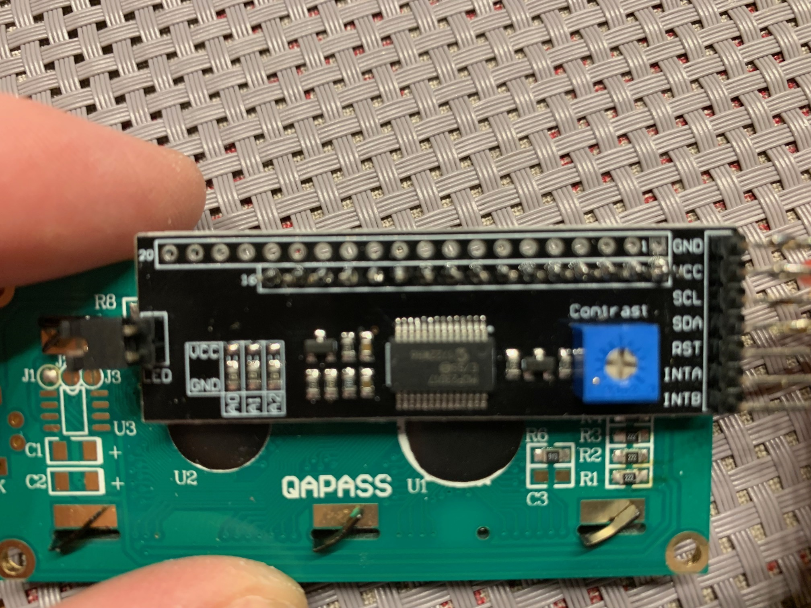
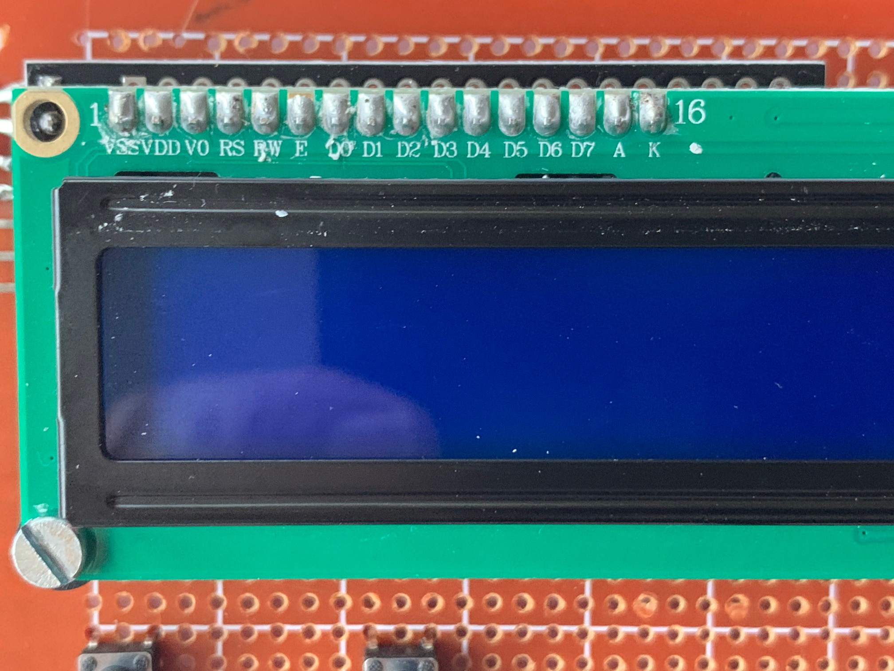

# LiquidCrystal_MCP23017_I2C

**LiquidCrystal_MCP23017_I2C** is a library for a LCD Driver Module based on
the chip MCP23017. This module can be attached to an 1602/2004/12864 LCD to
reduce the high amount of controlling pins on an Arduino to only 2 pins for I2C.

The default **LiquidCrystal_I2C** library is designed for the chip PCF8574 and
does not work with the MCP23017 I2C Port Expander.

This library has an easy to use default pin mapping which matches the layout of of my
I2C board shown below in the picture:

If you have a different LCD Driver Module, an individual pin mapping
from the MCP23017 to the 1602 LCD is possible. Simply use the other
construtors either for 8-bit mode or for 4-bit mode.

## Copyright
**LiquidCrystal_MCP23017_I2C** is written by Andreas Trappmann from
[Trappmann-Robotics.de](https://www.trappmann-robotics.de/). It is published
under the MIT license, check LICENSE for more information.
All text above must be included in any redistribution

Release Notes:

Version 1.1 - 27.04.2020

	* Added constructor with default pin mapping.

Version 1.0 - 12.02.2020

	* Initial Version
